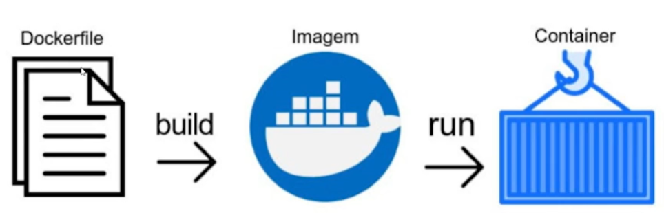

# Docker
Curso realizado na plataforma Alura. Link do curso [aqui](https://cursos.alura.com.br/course/docker-criando-gerenciando-containers).

## Conhecendo Docker

**Máquinas virtuais** são capazes de isolar sistemas, com isso, o controle sobre a aplicação fica mais fácil. 

Máquinas virtuais possuem camadas adicionais de virtualização em relação a um container;

**Containers** podem isolar diversas aplicações, **facilitando o controle** acerca de portas e versões.
* Containers funcionam como processos no host;
* Containers atingem isolamento através de namespaces;
* Os recursos dos containers são gerenciados através de cgroups.

Os containers *são mais leves* do que máquinas virtuais.

**Vantagens do Docker:** isolamento de contextos e versionamento de aplicações.

## Instalando o docker no Windows

Acessar o site da [Docker](https://docs.docker.com/get-docker/) e realizar o download para Windows.

## Docker Hub
O Docker Hub é um grande repositório de imagens que podemos utilizar;

A base dos containers são as imagens;

## Os primeiros comandos
### Comando docker run

O comando **docker run** é responsavel por executar um container em nosso host. Através deste comando, o docker irá executar o container da maneira esperada.
```
docker run hello-world
```


* Procura a imagem localmente -> Informa que não foi possivel encontrar a imagem na maquina local.
* Baixa a imagem caso não encontre localmente -> Realiza o download da imagem. Existe um grande repositorio de imagens (Docker Hub). **hello-world** é uma imagem.
* Valida o hash da imagem 
* Executa o container -> Executa a imagem/container.

### Comando docker ps

```
docker ps
```
Informa quais os container **estão em executação** nesse momento.
Se informar so o cabeçalho, indica que a lista esta vazia. 

### Comando docker container ls
Semelhante ao comando docker ps, porem mais verboso.

```
docker container ls
```

### Comando docker container ls -a ou docker ps -a
```
docker container ls -a
#ou
docker ps -a
```

Informa as imagens que foram executadas e/ou estao em execução.

Os containers são encerrados porque nao há **processos** para manter eles em execução.

    No comando abaixo, há um processo travando o container por 1 dia.

```
docker run ubunto sleep 1d
```

### Comando docker stop
Visualiza os container através de docker ps. Para parar uma imagem basta informar o id do container ou o names.
```
docker stop [container id ou names]
```
Visualizar os containers parados atraves do comando docker ps -a

é possivel passar um tempo.
```
docker stop -t=0 [container id ou names]
```

### Comando docker rm [container id ou names]
Remove o container

### Comando exec -it [container id] bash
Permite executar container em modo interativo. Acessa o terminal do container que foi criado.
Um comando bastante utilizado é:

```
docker exec -it ubuntu bash
```
Criamos um container novo e ja estamos diretamente no terminal dele. 

## Docker run vs Docker exec
O **docker run** cria um novo container e o executa. O **docker exec** permite executar um comando em um container que já está em execução.

## Mapeando portas

-d nao trava o terminal (mantém o processo vivo) : **docker run -d [nome-container]**

-P executa container e exibe a porta : **docker run -d -P [nome-container]; docker ps ; docker port [id]**

- docker port é o comando responsável por exibir como o pameapmento de portas d eum container esta sendo feito.
```
- docker run -d -P dockersample/static-site
- docker ps
- docker port [id] (informa para onde foi mapeada)
- docker run -d -p 8080:80 dockersample/static-site
```

Este comando é responsável por exibir como o mapeamento de portas de um container está sendo feito.
```
docker port
```
## Comandos de Ciclo de vida dos containers
* **docker start**, para iniciar um container que esteja parado; 
* **docker stop**, para parar um que esteja rodando; 
* **docker pause**, para pausar um container ;
* **docker unpause** para iniciar um container pausado; 
* Conseguimos **mapear portas** de um container com as flags -p e -P.

## Criando e compreendendo imagens

### O que são imagens?
**Conjunto de camadas** que unidas formam imagens. Cada camada possui um identificador, isto é, são independentes. Logo, imagens são compostas por uma ou mais camadas. (As camadas são a menor unidade que compõem uma imagem.)

Consideradas **receitas** para gerar containers.

Uma imagem é read only. Quando criamos um container, nada mais é do que as camadas de read only + uma camada read/write. Quando um container é deleta, essa camada também é deletada. 

Imagens são imutáveis, ou seja, depois de baixadas, múltiplos containers conseguirão reutilizar a mesma imagem;

Visualizar imagens baixadas:
```
docker images
```
Visualiza/inspeciona uma imagem:
```
docker inspect [ID]
```
Visualiza o historico - Este comando é responsável por exibir quais são as camadas de uma imagem.:
```
docker history [ID]
```

### Criando imagem


Podemos criar nossas imagens através de Dockerfiles e do comando docker build.

Cria-se o arquivo Dockerfile.
Dentro deste arquivo, informamos o que iremos de base.
Ex: preciso do node, portanto
```
FROM node:14
WORKDIR /app-node
COPY . .
RUN npm install
ENTRYPOINT npm start
```
Após, cria-se, via terminal, a imagem:
```
docker build -t annekaroline/app-node:1.0 .
```

* A instrução **FROM** é usada para definirmos uma imagem como base para a nossa.
* A **instrução ARG** carrega variáveis apenas no momento de build da imagem
* A **instrução ENV** carrega variáveis que serão utilizadas no container.


Rodando docker criado:


Incrementando (Informando a porta):
```
FROM node:14
WORKDIR /app-node
EXPOSE 3000
COPY . .
RUN npm install
ENTRYPOINT npm start
```

## Subir imagem para o Docker Hub
Para subir uma imagem no Docker Hub, utilizamos o comando docker push.

1. Cadastrar e acessa o Docker Hub
2. docker tag [nome-desejado-para-a-imagem] e docker push [nome-desejado-para-a-imagem]

## REMOVER OS CONTAINERS
```
docker container rm $(docker container ls -aq)
```
## Persistindo dados

Quando containers são removidos, nossos dados são perdidos. Podemos persistir dados em definitivo através de volumes e bind mounts

Com **volumes**, é possível escrever os dados em uma camada persistente. Volumes são gerenciados pelo Docker.

Com **bind mounts**, é possível escrever os dados em uma camada persistente baseado na estrutura de pastas do host. Bind mounts dependem da estrutura de pastas do host.

### Usando bind mounts
Os bind mounts são capazes de persistir dados de containers através de um vínculo criado com a estrutura de pastas do nosso host. Porém, ainda precisamos fixar como criar um.

**Cria pasta:** mkdir volume docker

**-v /home/user/volume-docker:/app** : informa que será utilizado o arquivo como persistencia de dados. Um diretório que foi criado para nosso container

```
docker run -it -v /home/user/volume-docker:/app ubuntu bash
```

Com esta sintaxe, criaremos um bind mount para o container baseado na imagem do nginx.
```
docker run –mount type=bind,source=/home/diretorio,target=/app nginx
```

### Utilizando Volumes
Volumes são gerenciados pelo Docker e independem da estrutura de pastas do sistema. Desta maneira, a persistência de dados independe de como as pastas do sistema estão estruturadas.

```
docker volume ls
docker volume create meu-volume
docker volume ls
```

Usando o volume com um container:
```
docker run -it -v meu-volumv:/app ubuntu bash
```

### Utilizando tmpfs
* Funciona em linux. 
* Tmpfs armazenam dados em memória volátil.

```
docker run -it --tmpfs=/app ubuntu bash
```

Cria a pasta verde, em tom verde. Significa que ela é temporaria, igual o tmp.

Similar a:

```
docker run -it --mount type=tmpfs, destination=/app ubuntu bash
```

## Comunicação através de redes
Utiliza-se redes com o Docker a fim de comunicar diferentes containers e aplicações.

O docker dispõe por padrão de três redes: 

* Host
* None
* Bridge

A rede host remove o isolamento entre o container e o sistema, enquanto a rede none remove a interface de rede.

A rede bridge é usada para comunicar containers em um mesmo host. Redes bridges criadas manualmente permitem comunicação via hostname.

A rede host remove o isolamento de rede entre o container e o host.

A rede none remove a interface de rede do container.

```
docker network ls
```

Dando nome ao container
```
docker run -it --name ubuntu1 ubuntu bash
```
Podemos criar redes com o comando **docker network create**.

Criando uma rede bridge:
```
docker network create --driver bridge minha-bridge
```

Informar a rede ao criar um container:

```
docker run -it --name ubuntu1 --network minha-bridge ubuntu bash
```

```
docker run -d --name pong --network minha-bridge ubuntu sleep 1d
```

## Coordenando Containers 

**Docker Compose**: O Docker Compose irá resolver o problema de executar múltiplos containers de uma só vez e de maneira coordenada, evitando executar cada comando de execução individualmente.

Cria-se um arquivo chamado **docker-compose.yml** e informamos os serviços.

Comando **docker-compose up**


Parâmetros que podemos definir com o Docker Compose:
* Nome do container: O nome do container é um parâmetro que pode ser definido com o Docker Compose.
* Rede que o container irá se conectar: A rede é um parâmetro que pode ser definido com o Docker Compose.
* Imagem a ser utilizada: A imagem é um parâmetro que pode ser definido com o Docker Compose.

